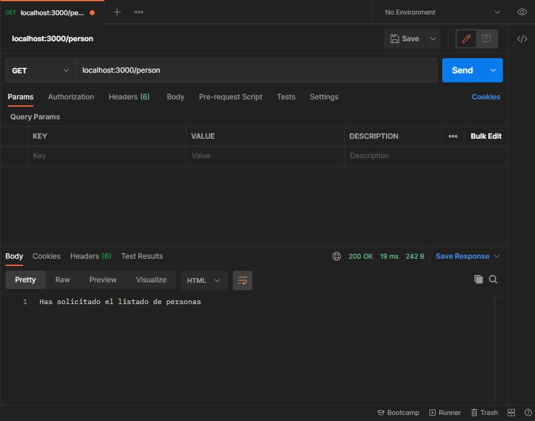

# Practica #18
## Servidor para RESTFUL API

Realizar una aplicacion para construir una RESTFUL API y comprobar su funcionamiento mediante POSTMAN

Resultado obtenido en POSTMAN  

**Referencias**
- [Instrucciones Practica 18](https://docs.google.com/document/d/18Ppvox_jbqSNlIRAwo5r8oNG0jGxR6D9pSsluGr5h6o/edit)