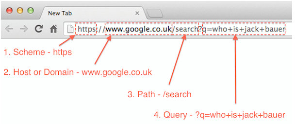
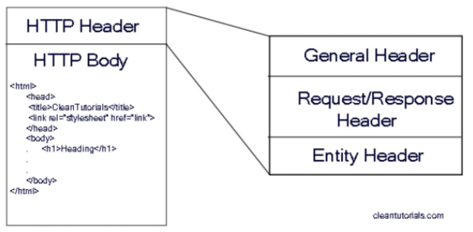

# Practica #13
## Template Engines y Query String

El query string o “cadena de consulta” es un mecanismo comúnmente utilizado para pasar información en peticiones HTTP.  Podemos identificar un query string de la siguiente forma:

en el encabezado, podemos identificar elementos que hemos abordado previamente, como el protocolo (HTTP/HTTPS), el URL, la ruta (path) para el cual hemos escrito un “route handler”, y después, seguido del signo de interrogación “?”, el “query string”.

Cuando la petición HTTP es del tipo GET, el query string es enviado en el “Header” del paquete HTTP

En cambio, cuando la petición es mediante POST, el query string es “movido” hacia el “body” y para acceder a su contenido es necesario “parsear” el contenido del “Body” de la petición  y obtener la información. La información que “viaja” durante la petición, puede ser  en formato de texto o en formato JSON, dependiendo de la necesidad.

**Referencias**
- [Instrucciones Practica 13](https://docs.google.com/document/d/1OFVMI4EWW182DijE6j8NvzYdESXvzBjy3x9H0s1U28g/edit)