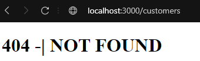

# Practica #19
## Servidor para RESTFUL API

Realizar una aplicacion para construir una RESTFUL API y comprobar su funcionamiento mediante POSTMAN

Resultado obtenido pagina 404  

Resultado obtenido en POSTMAN  

**Referencias**
- [Instrucciones Practica 19](https://docs.google.com/document/d/1AwClas8HBbTLsWj63FAmFPHD2bBhFwleYbigxbN7ge0/edit)